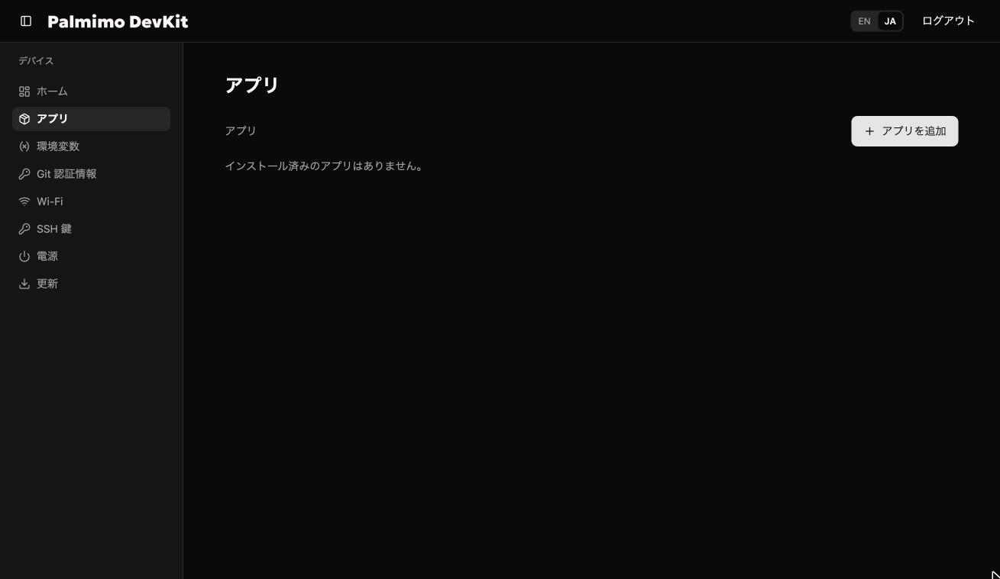
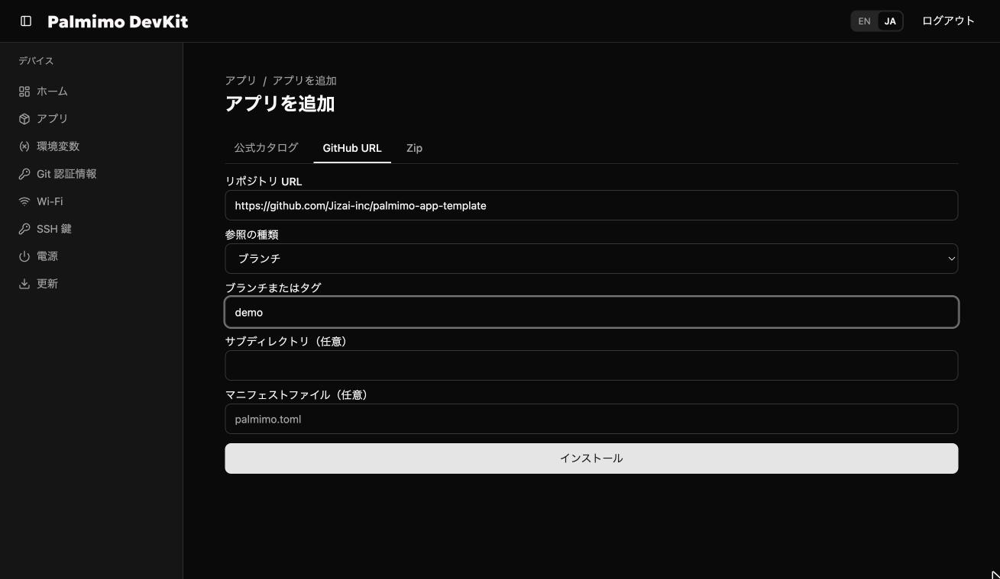
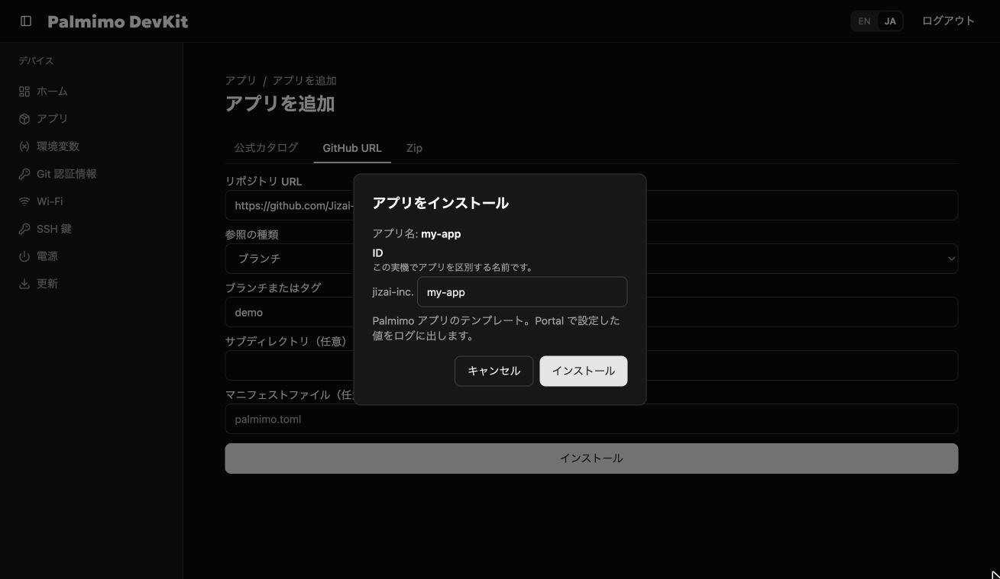
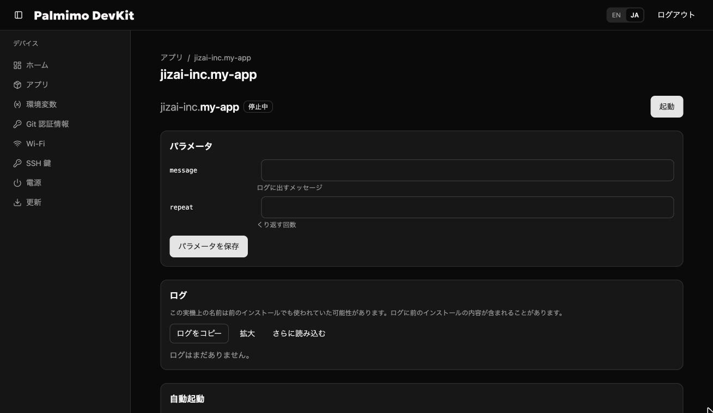
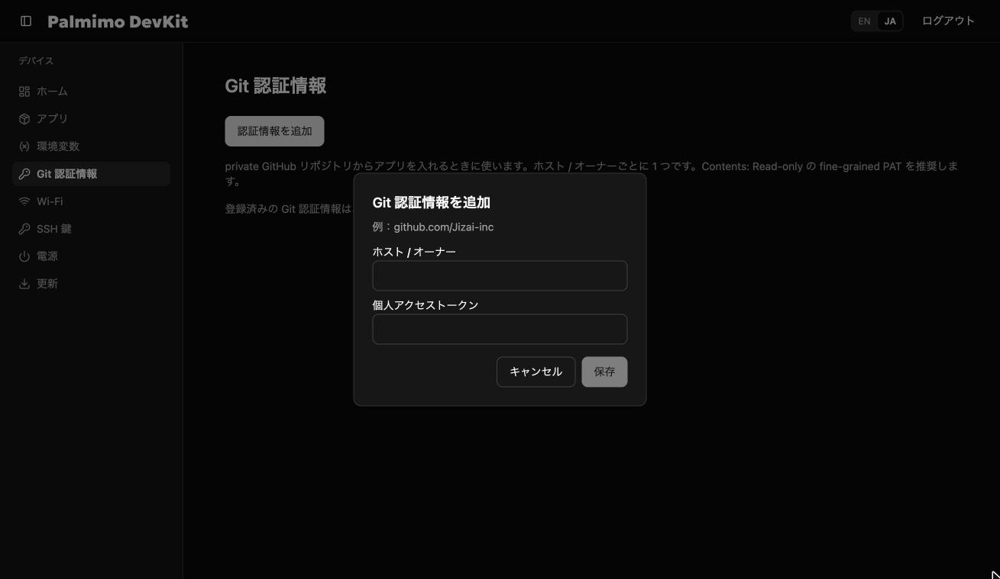
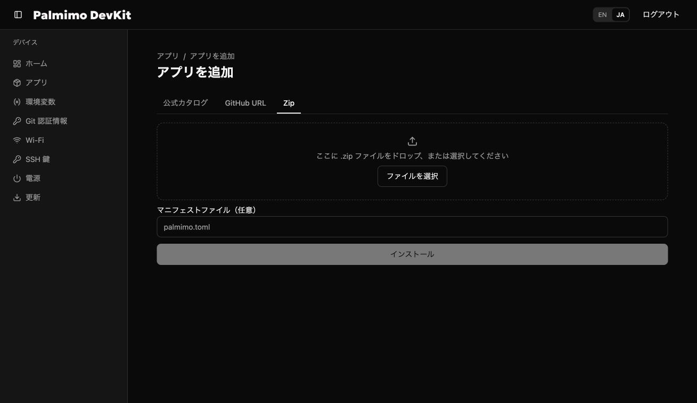
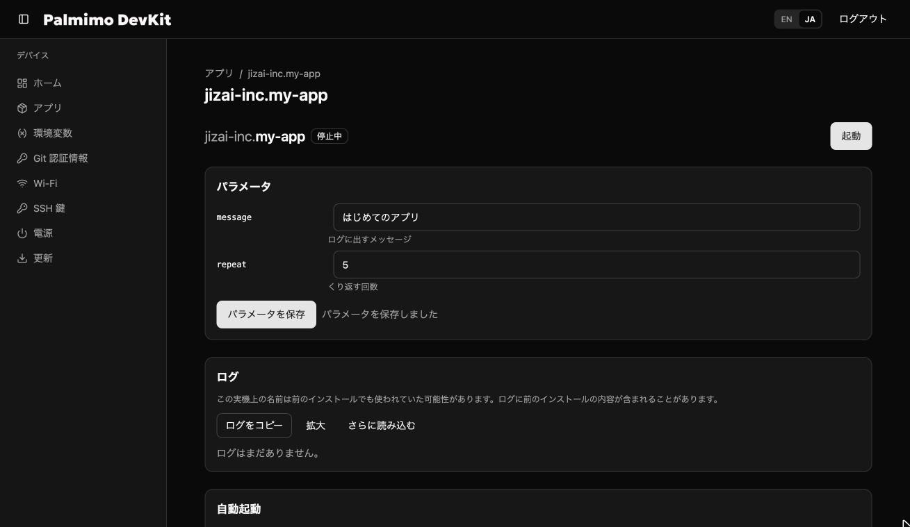
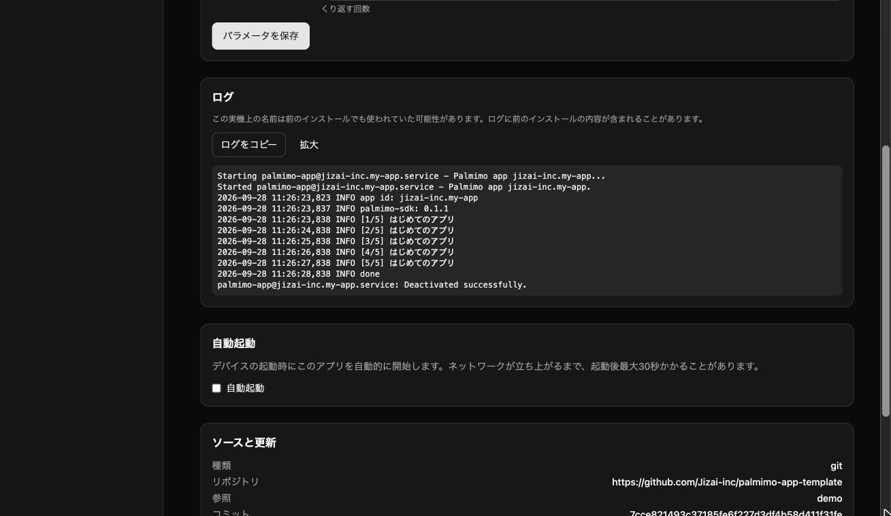
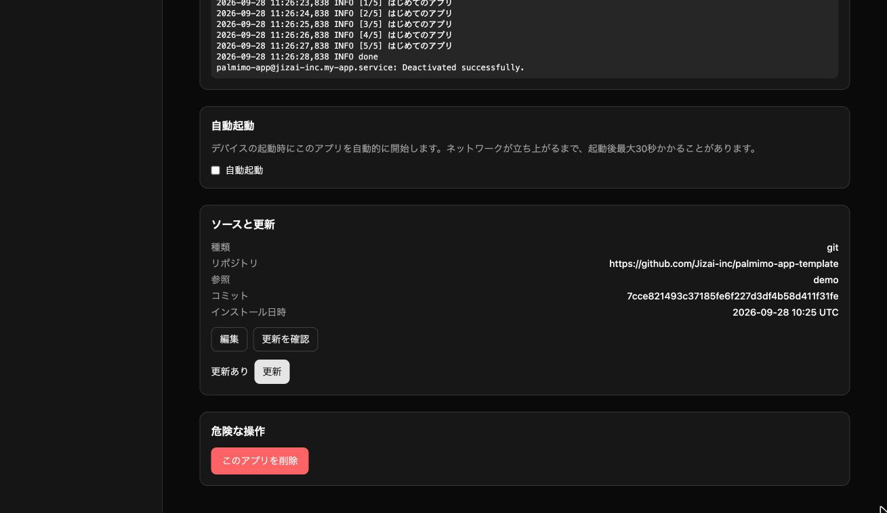
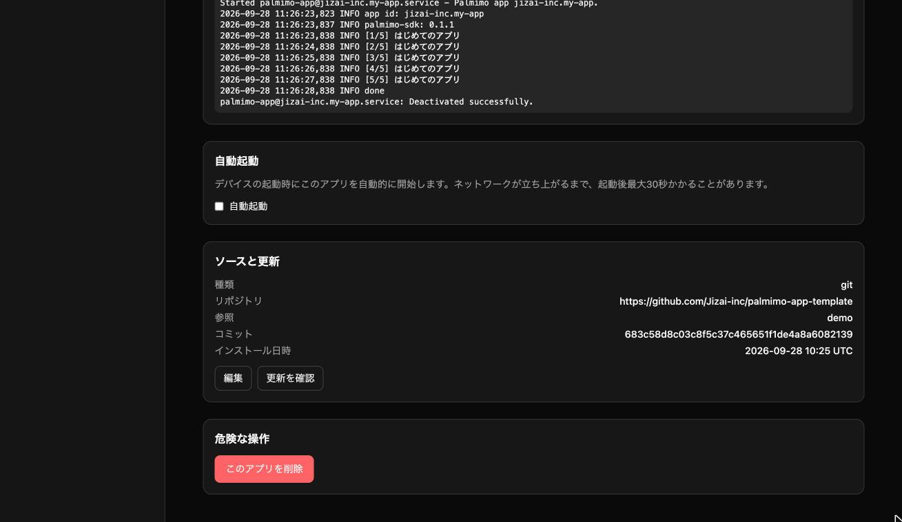

# palmimo-app-template

Palmimo DevKit で動かすアプリのテンプレートです。Palmimo Portal（DevKit の管理画面）から
インストール・起動・更新できる形になっています。

入っているもの:

| ファイル | 役割 |
|---|---|
| `palmimo.toml` | Portal がアプリを一覧に出し、設定フォームを作り、起動するための定義（マニフェスト） |
| `main.py` | サンプル。Portal で設定した値をログに出すだけで、ハードウェアには触りません |
| `.gitignore` | `.venv/` などをコミットしないための設定 |

`pyproject.toml` と `uv.lock` はあえて入れていません。手順 2 で `uv init` と `uv add` を実行して作ると、
その時点の最新の palmimo-sdk が入ります。

## 1. 開発手順

### 必要なもの

- [uv](https://docs.astral.sh/uv/)
- git
- 同じネットワークにある Palmimo DevKit と、その Portal にログインできるブラウザ

### テンプレートから自分のリポジトリを作る

GitHub のこのリポジトリで **Use this template** → **Create a new repository** を選び、
自分のアカウント（または組織）にリポジトリを作って clone します。

```bash
git clone https://github.com/<owner>/<repo>.git
cd <repo>
```

### Python プロジェクトにする

```bash
uv init --app --python 3.13
uv add palmimo-sdk
```

- `uv init` は `pyproject.toml` と `.python-version` を作ります。テンプレートの `main.py`・`README.md`・`.gitignore` は上書きされません。
- `uv add palmimo-sdk` で最新の palmimo-sdk が入り、`uv.lock` ができます。
- `--python 3.13` は DevKit に入っている Python の版です。別の版を指定すると、Portal がインストール時にその版の Python を取得するので、初回のインストールに時間がかかります。

手元で動かしてみます。

```bash
uv run python main.py --message "テスト" --repeat 2
```

### アプリを作る

1. `palmimo.toml` の `name` と `description` を自分のアプリに合わせて書き換えます。
   - `name` は英小文字・数字・ハイフンで 40 文字まで（先頭は英字）です。
   - 端末上のアプリ ID は `<入れた場所>.<name>` になります。GitHub から入れたときの「入れた場所」は owner 名、zip なら `zip` です。
2. `main.py` を書き換えます。`palmimo_sdk` の使い方は [palmimo-devkit のドキュメント](https://github.com/Jizai-inc/palmimo-devkit/tree/main/doc)を参照してください。
3. 必要なら `palmimo.toml` を書き換えます。
   - `command`: 起動するコマンド。アプリのディレクトリで `uv run` を通して実行されます。
   - `[params.*]`: Portal の画面から変えられる設定。`command` の中の `{名前}` が設定値に置き換わります。
   - `devices`: サーボ（`motor_display`）、カメラ（`camera`）、マイク・スピーカー（`audio`）を使うときに宣言します。宣言しないデバイスはアプリから開けません。
   - `[env.*]`: API キーなどの秘密の値。値は Portal の「環境変数」画面で入れます。

   書き方の全体は [マニフェストの仕様](https://github.com/Jizai-inc/palmimo-devkit/blob/main/doc/reference/app-manifest.md)にあります。

4. `pyproject.toml`・`uv.lock`・`.python-version` も含めてコミットし、push します。

```bash
git add .
git commit -m "My first Palmimo app"
git push
```

`uv.lock` は必ずコミットしてください。Portal は `uv.lock` どおりに依存を入れるので、手元と DevKit で同じ版がそろいます。

## 2. DevKit へのインストール（アップロード）

入れ方は 3 つあります。**GitHub から入れるのがおすすめです**。push するだけで、あとから Portal で更新できます。

### GitHub から入れる（公開リポジトリ）

1. Portal の **アプリ** を開き、**アプリを追加** を押します。

   

2. **GitHub URL** タブで、リポジトリの URL とブランチ（またはタグ）を入れて **インストール** を押します。
   `palmimo.toml` がリポジトリの直下にないときは、**サブディレクトリ** にそのディレクトリを入れます。

   

3. 確認画面で **ID**（端末上の名前）を確かめて **インストール** を押します。同じ名前のアプリがすでにあると `-2` などが付きます。ここで名前を変えることもできます。

   

4. インストールが終わると、アプリの画面が開きます。

   

### GitHub から入れる（非公開リポジトリ）

非公開リポジトリは、先に Portal にアクセストークンを登録します。

1. GitHub で **fine-grained personal access token** を作ります。対象のリポジトリを選び、権限は **Contents: Read-only** だけにします。
2. Portal の **Git 認証情報** → **認証情報を追加** で、**ホスト / オーナー**（例: `github.com/<owner>`）とトークンを入れて保存します。
   登録はオーナーごとに 1 つで、同じオーナーでもう一度保存すると置き換わります。

   

3. あとは公開リポジトリと同じ手順で入れます。

### zip で入れる

GitHub を使わないときは zip でも入れられます。ただし **zip で入れたアプリには更新機能がありません**（後述）。

1. zip を作ります。`git archive` を使うと、コミットしたファイルだけが入ります。`.venv/` は入れないでください（シンボリックリンクを含む zip はインストールできません）。

   ```bash
   git archive -o my-app.zip HEAD
   ```

2. **アプリを追加** の **Zip** タブで zip を選び、**インストール** を押します。

   

zip は 200 MB まで、展開後の合計は 1 GB までです。

## 3. 起動と設定

1. アプリの画面の **パラメータ** で値を入れて **パラメータを保存** を押します。

   

2. 右上の **起動** を押すと、**ログ** にアプリの出力が出ます。止めるときは **停止** を押します。

   

- **自動起動** にチェックを入れると、DevKit の電源を入れたときにこのアプリが自動で起動します。
- アプリの起動中は、ほかのアプリのインストール・更新・削除はできません。

## 4. アップデート

### GitHub から入れたアプリ

1. 手元で変更してコミットし、GitHub に push します。依存を増やしたときは `uv.lock` もコミットします。

   ```bash
   git commit -am "Update my app"
   git push
   ```

2. Portal のアプリの画面の **ソースと更新** で **更新を確認** を押します。新しいコミットがあると **更新あり** と出るので、**更新** を押します。

   

3. 更新が終わると、**コミット** が push したものに変わります。パラメータ・自動起動・環境変数の設定はそのまま残ります。

   

- 起動中のアプリは更新できません。先に **停止** してください。
- 入れるブランチやタグを変えるときは、**ソースと更新** の **編集** から変えます。
- タグで入れた場合は、新しいタグを作って **編集** でそのタグに切り替えます。

### zip で入れたアプリ

zip で入れたアプリは更新できません。アプリの画面の **このアプリを削除** で削除してから、新しい zip を入れ直してください。
パラメータなどの設定は入れ直すと消えるので、控えておいてください。

## 困ったとき

- **インストールで失敗する**: エラーの内容はダイアログに出ます。多いのは次のものです。
  - `palmimo.toml` の書き方の誤り
  - `pyproject.toml` や `uv.lock` のコミット忘れ
  - 非公開リポジトリで Git 認証情報を登録していない
- **起動してすぐ止まる**: **ログ** にエラーが出ます。手元で `uv run python main.py` が動くかを先に確かめてください。
- **マニフェストの細かい仕様**: [app-manifest.md](https://github.com/Jizai-inc/palmimo-devkit/blob/main/doc/reference/app-manifest.md)
